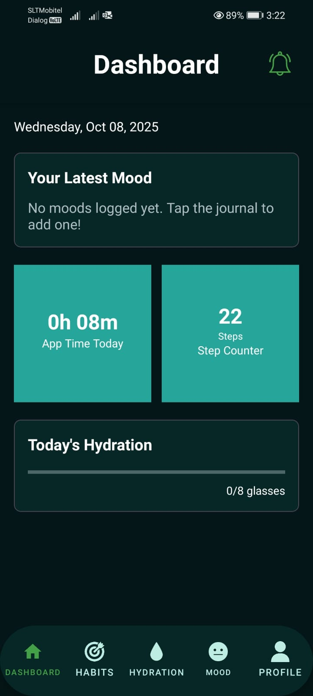
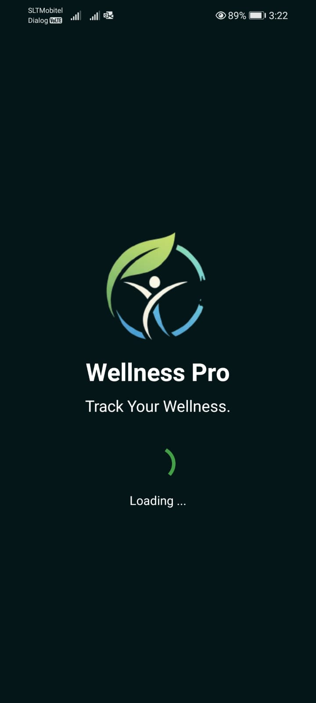
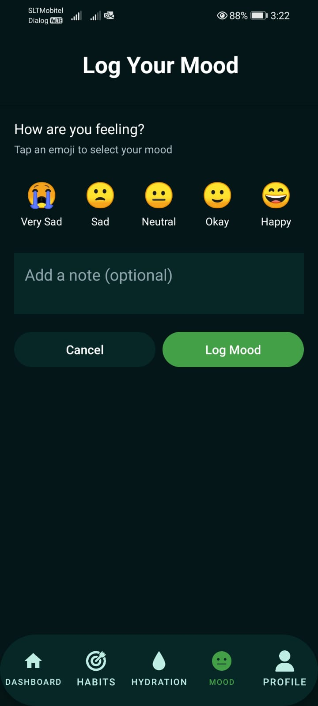
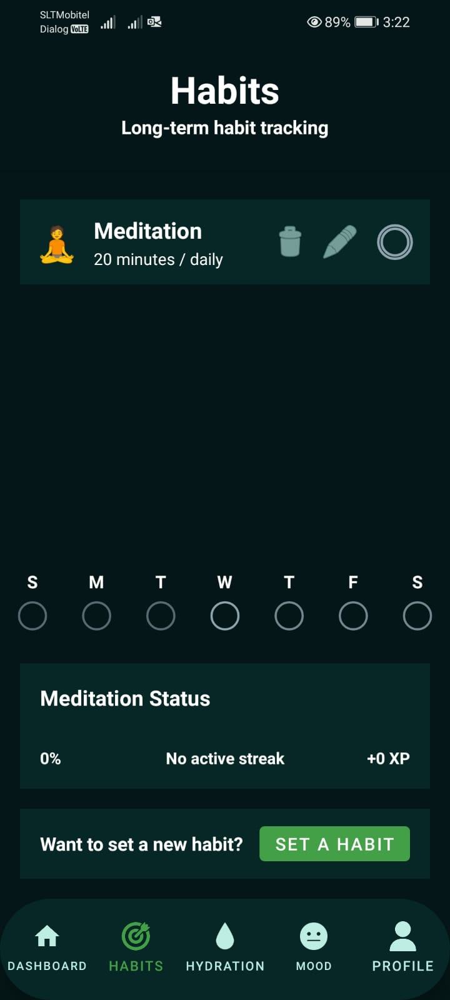
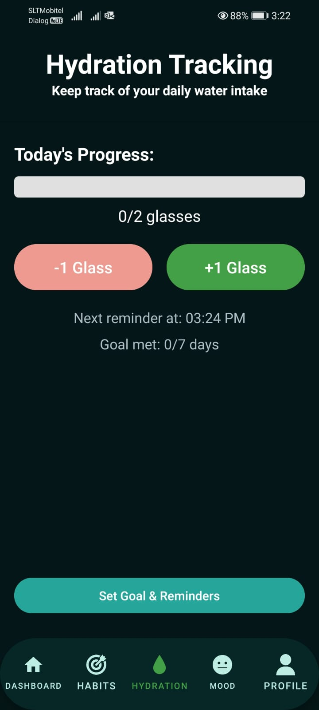
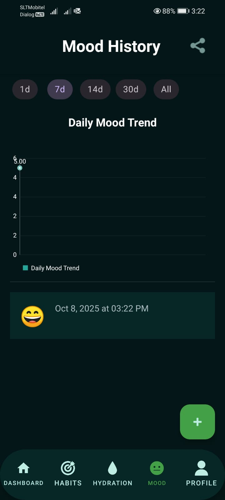
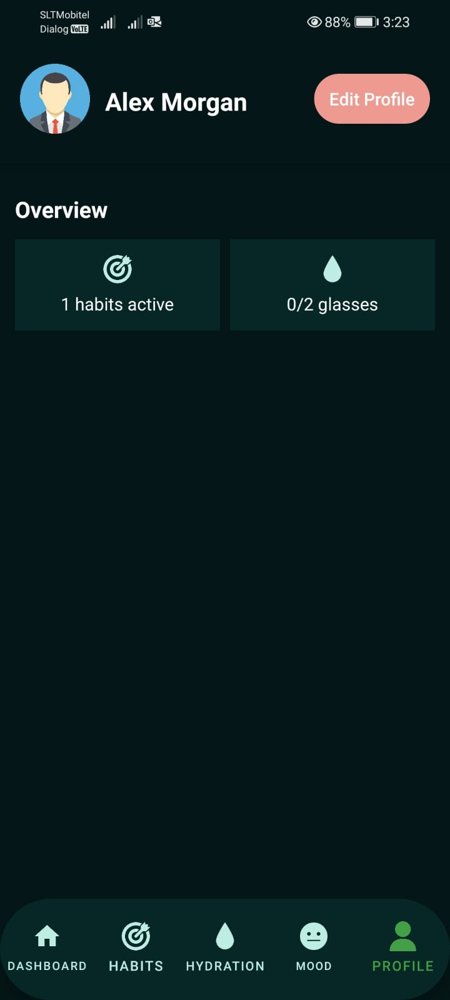
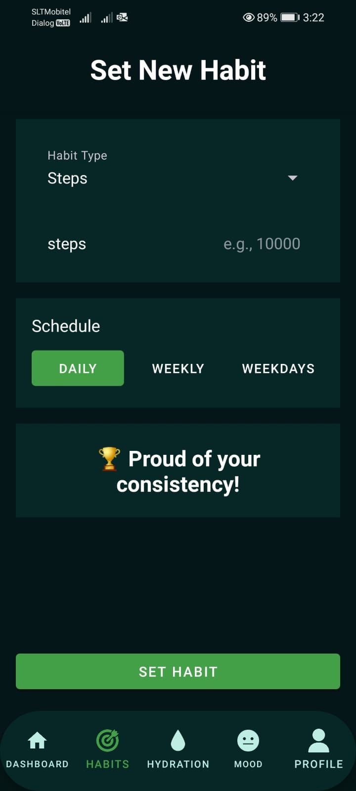
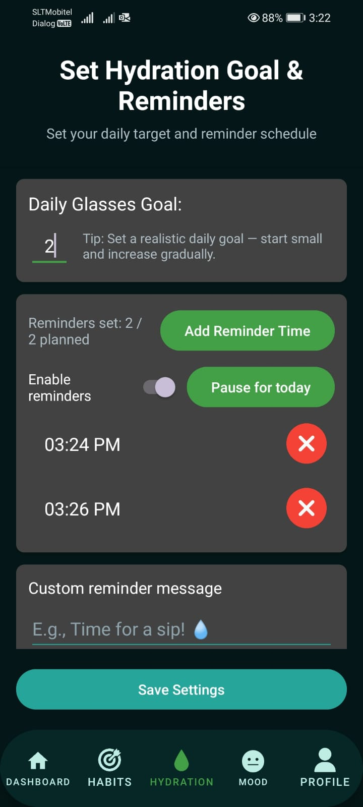
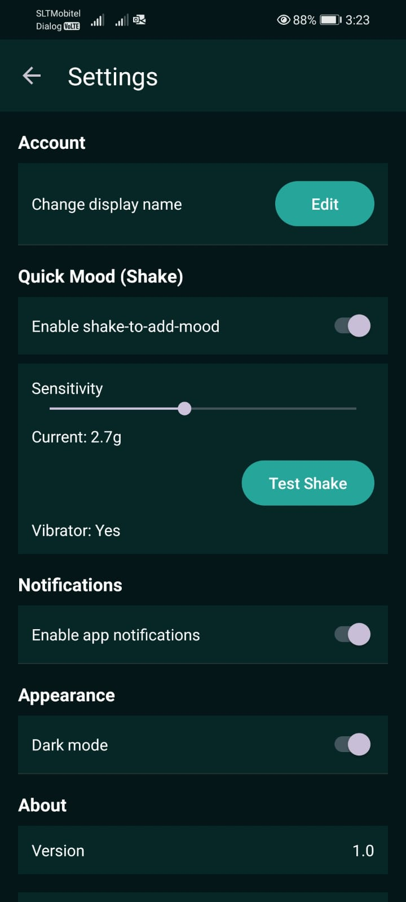

# Wellness Pro

Wellness Pro is a simple Android app for daily wellness tracking: mood journaling, habit tracking, and hydration reminders.

## Features
- Mood Journal: log moods with optional notes and view history.
- Habits: create and track habits with progress and streaks.
- Hydration: log water intake, view daily totals, and receive local reminders.
- Local Reminders: scheduled with WorkManager with AlarmManager fallback.

## Screenshots
<table>
  <tr>
    <td></td>
    <td></td>
    <td></td>
  </tr>
  <tr>
    <td></td>
    <td></td>
    <td></td>
  </tr>
  <tr>
    <td></td>
    <td></td>
    <td></td>
  </tr>
  <tr>
    <td></td>
    <td></td>
    <td></td>
  </tr>
</table>
